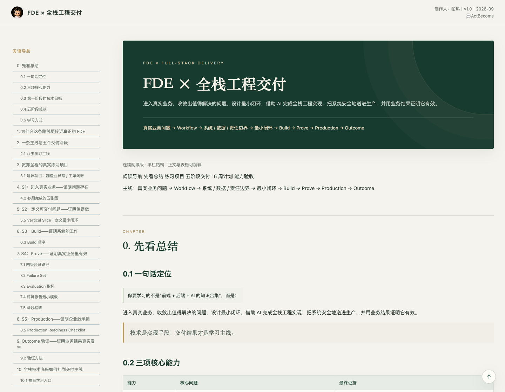

# FDE × 全栈工程交付

> 从真实业务问题出发，把最小闭环做成可验证、可上线、可持续使用的系统。

**[View Live Demo · 在线阅读](https://parr031010-coder.github.io/FDe-fullstack-delivery/)** · [查看正式 HTML 文档](index.html)

[](https://parr031010-coder.github.io/FDe-fullstack-delivery/)

## 项目简介

这是一本面向 FDE（Forward Deployed Engineer）与全栈工程交付学习者的中文实践手册。它以「制造业异常 / 工单闭环」为贯穿项目，把问题收敛、工程实现、现场判断与业务结果验证连接起来，而不是单纯罗列技术栈。

**交付主线：**

真实业务问题 → Workflow → 系统 / 数据 / 责任边界 → 最小闭环 → Build → Prove → Production → Outcome

> 本仓库交付的是静态阅读文档，不是已经实现的工单业务系统；文中的 API、数据库、AI Agent 等内容属于学习与实践指引。

## 内容导览

最新版正文包含编号 0–16 的 17 个章节，重点包括：

| 模块 | 核心内容 |
| --- | --- |
| 三项核心能力 | 问题收敛、工程交付、现场判断 |
| S1 · 进入真实业务 | 用流程、证据、基线与责任边界证明问题存在 |
| S2 · 定义可交付问题 | Outcome Contract、目标流程、AI / No-AI 判断与 Vertical Slice |
| S3 · Build | 状态机、数据库、接口、页面、权限、异常处理与测试 |
| S4 · Prove | Offline → Shadow → HITL → Staging、Failure Set 与 Evaluation |
| S5 · Production | 生产就绪检查、监控、人工接管、降级、回滚与持续运营 |
| Outcome · 结果验证 | 用业务指标与基线对比验证真实改善 |
| 学习与验收 | 全栈技术底座、16 周计划、专项资源、AI 使用守则与个人能力验收 |

## 阅读体验

- 桌面端提供固定阅读导航与章节锚点。
- 小屏幕采用单栏布局，宽表格可横向滚动。
- 支持返回顶部与浏览器打印；打印时隐藏导航等辅助元素。
- CSS、JavaScript、标识图片和 favicon 均内嵌在 HTML 中，无需构建或安装依赖。
- 正文中的外部学习资料需要联网访问，其可用性由对应网站维护。

## 本地查看

直接用浏览器打开根目录的 `index.html`，或在仓库根目录启动静态服务器：

```bash
python3 -m http.server 8000
```

然后访问 <http://localhost:8000/>。

## 仓库结构

```text
fde-fullstack-delivery/
├── README.md
├── index.html           # 唯一正式文档，保留所提供 HTML 的原始内容
└── assets/
    └── preview.png      # 从当前 index.html 重新截取的页面预览
```

## 版本与发布

- **唯一内容入口：** 根目录 `index.html`。不保留平行旧版页面或旧版资源。
- **文档署名：** 帕热；文档内标记为 v1.0 / 2026-09，本次部署不改写原文版本信息。
- **Preview：** 2026-09-20 基于本次提供的 `index.html` 重新截图，不复用历史图片。
- **GitHub Pages：** 使用 **Deploy from a branch → `main` → `/ (root)`**，站点根路径默认展示 `index.html`。
- **更新方式：** 替换 `index.html` 后，应同步重截 `assets/preview.png`，核对 README、章节导航和页面加载，再提交到 `main`。

本次正式 HTML 的 SHA-256（用于核对原文件、仓库与线上版本）：

```text
bd3b82f446e5ba5729ad4ecdb1f3e25374c80cbc21d4be265c61cde159f167be
```
